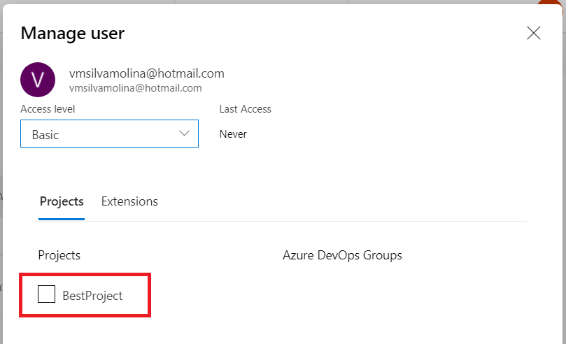
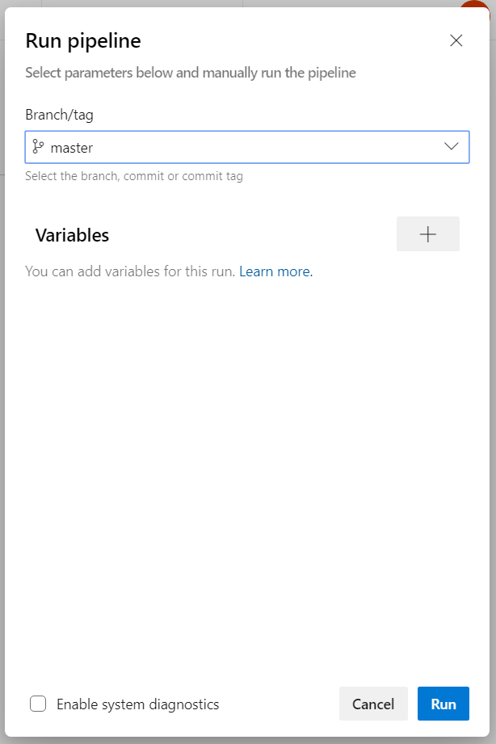

# Azure DevOps - Workshop

## Contenido
<!-- TOC -->

- [Azure DevOps - Workshop](#azure-devops---workshop)
  - [Contenido](#contenido)
  - [Resumen y objetivos](#resumen-y-objetivos)
  - [Introducción](#introducci%c3%b3n)
  - [Arquitectura de la solución](#arquitectura-de-la-soluci%c3%b3n)
  - [Ejercicio 1: Preparar las herramientas locales](#ejercicio-1-preparar-las-herramientas-locales)
    - [Tarea 1: Instalar Visual Studio Code](#tarea-1-instalar-visual-studio-code)
    - [Tarea 2: Instalar Git](#tarea-2-instalar-git)
    - [Tarea 3: Clonar el repositorio del workshop](#tarea-3-clonar-el-repositorio-del-workshop)
  - [Ejercicio 2: Crear un proyecto en Azure DevOps y un repositorio Git](#ejercicio-2-crear-un-proyecto-en-azure-devops-y-un-repositorio-git)
    - [Tarea 1: Crear una cuenta Azure DevOps](#tarea-1-crear-una-cuenta-azure-devops)
    - [Tarea 2: Agregar el repositorio de código a Azure DevOps](#tarea-2-agregar-el-repositorio-de-c%c3%b3digo-a-azure-devops)
    - [Tarea 3: Agregar usuarios al proyecto](#tarea-3-agregar-usuarios-al-proyecto)
  - [Ejercicio 3: Crear un build pipeline en Azure DevOps](#ejercicio-3-crear-un-build-pipeline-en-azure-devops)
    - [Tarea 1: Crear el build pipeline](#tarea-1-crear-el-build-pipeline)
  - [Ejercicio 4: Crear un release pipeline en Azure DevOps](#ejercicio-4-crear-un-release-pipeline-en-azure-devops)
    - [Tarea 1: Crear una release definition](#tarea-1-crear-una-release-definition)
  - [Ejercicio 5: Ejecutar un build y release](#ejercicio-5-ejecutar-un-build-y-release)
    - [Tarea 1: Manualmente desencadenar un nuevo build seguido de un release](#tarea-1-manualmente-desencadenar-un-nuevo-build-seguido-de-un-release)
  - [Ejercicio 6: Crear una feature branch y cargar un pull request](#ejercicio-6-crear-una-feature-branch-y-cargar-un-pull-request)
    - [Tarea 1: Crear una branch](#tarea-1-crear-una-branch)
    - [Tarea 2: REalizar un cambio de código a la feature branch](#tarea-2-realizar-un-cambio-de-c%c3%b3digo-a-la-feature-branch)
    - [Tarea 3: Submit un pull request](#tarea-3-submit-un-pull-request)
    - [Tarea 4: Aprobar y completar el pull request](#tarea-4-aprobar-y-completar-el-pull-request)
  - [Ejercicio 7: Automatizar el despliegue de infraestructura con Ansible y Azure Pipelines](#ejercicio-7-automatizar-el-despliegue-de-infraestructura-con-ansible-y-azure-pipelines)

<!-- /TOC -->

## Resumen y objetivos

En este laboratorio práctico, se detallará cómo implementar una solución con una combinación de templates de configuración para permitir la entrega continua con varios servicios gracias a Azure DevOps.

Al finalizar este workshop, podrá implementar soluciones de entrega continua con Azure DevOps, así como crear y gestionar un proyecto junto con el o los repositorios Git.

## Introducción

La organización StrangerDevOps tiene el requerimiento de automatizar el proceso de desarrollo...
Tailspin Toys has asked you to automate their development process in two specific ways. First, they want you to define an Azure Resource Manager template that can deploy their application into the Microsoft Azure cloud using Platform-as-a-Service technology for their web application and their PostgreSQL database. Second, they want you to implement a continuous delivery process that will connect their source code repository into the cloud, automatically run their code changes through unit tests, and then automatically create new software builds and deploy them onto environment-specific deployment slots so that each branch of code can be tested and accessed independently.

## Arquitectura de la solución


## Ejercicio 1: Preparar las herramientas locales

>  Duración: 15 minutos

Como primer ejercicio vamos a desplegar localmente las herramientas y recursos necesarios para realizar el workshop.

### Tarea 1: Instalar Visual Studio Code

1.  Ingresar a la siguiente URL: <https://code.visualstudio.com/>.

2.  Seleccionar el botón *Download for Windows*.

3.  Ejecutar el asistente de instalación.

### Tarea 2: Instalar Git

1.  Ingresar al siguiente sitio: <https://git-scm.com>.

2.  Busque el icono con la pantalla de la computadora a la izquierda que dice *Last source Release* y haga clic en "Download for windows".

    

3.  Ejecutar el asistente y avanzar con los botones "Next" hasta la sección "Adjusting your PATH environment". Click en la opción "**Use Git and optional Unix tools from the Windows Command Prompt**". Luego, click en Next.

    

4.  Click en Next dos veces hasta llegar a la sección "Configuring the terminal emulator to use Git Bash", seleccionar la opción "**Use Windows' default console window.**". Click en Next y luego en Install.

5.  Abrir la línea de comandos (o PowerShell) y ejecutar los siguientes comandos:

    ```
    git config --global user.name "<your name>"
    git config --global user.email <your email>
    ```

### Tarea 3: Clonar el repositorio del workshop

1.  Ubicarnos en la carpeta donde vamos a guardar el proyecto, dentro de la línea de comandos.

2.  Ejecutar el siguiente comando:
   
   ```
   git clone https://github.com/vmsilvamolina/AzureDevOpsWorkshop.git
   ``` 

3.  Luego comprobar los archivos descargados y para demostrar que tenemos sincronizado nuestro repositorio con el origen ejecutar el siguiente comando:

    ```
    git status
    ```

## Ejercicio 2: Crear un proyecto en Azure DevOps y un repositorio Git

> Duración: 15 minutos

En este ejercicio, se creará y configurará una cuenta de Azure DevOps junto con un proyecto Agile.

### Tarea 1: Crear una cuenta Azure DevOps

1.  Vaya al sitio de Azure DevOps con la siguiente URL: <https://dev.azure.com>.

2.  Si aún no tiene una cuenta, seleccionar el botón **Start free**.
    
    

3.  Autenticarse con una cuenta Microsoft.

4.  Elegir **Continue** para aceptar los Terms of Service, Privacy Statement, y Code of Conduct.

5.  Seleccionar un nombre para el nuevo proyecto. Para el propósito de este workshop, se usará "BestProject". Elegir **Private** en la sección Visibility para que nuestro proyecto solamente sea visible para aquellos a quienes otorgamos permisos específicamente. Luego, seleccionar **+ Create project**.
    
    

6.  Una vez que el proyecto se encuentra creado, click en la opción del menú de navegación sobre la izquierda **Repos**.

    

7.  En la página de **Repos** para el repositorio del proyecto **BestProject**, ubicar la sección que indica lo siguiente: "*or push an existing repository from command line*". Click en el botón Copy para copiar el contenido del panel (comandos). Vamos a utilizarlos en la próxima tarea.

    


### Tarea 2: Agregar el repositorio de código a Azure DevOps

En esta tarea, se configurará el repositorio Git en Azure DevOps. Trabajaremos el repositorio remoto con Git y luego se realizará un push del código fuente a Azure DevOps a través de las herramientas de línea de comandos.

1.  Desde la línea de comandos, navegar hasta la ruta donde se encuentra el repositorio que descargamos en el ejercicio anterior.

2. Abrir la carpeta en VSCode con todos los archivos ejecutando: 
   
   ```
   code .
   ``` 
   
   >**Nota**: Asegurarse de incluir el punto (.) luego del comando (separado por un espacio).

   Examinar la estructura de los archivos.
   
3.  Desde la línea de comandos, iniciar un repositorio local Git por medio de la ejecución del siguiente comando:

    > Si ya existe una carpeta ".git" en el repositorio local, asegurarse de eliminarla antes de ejecutar el siguiente comando para iniciar un nuevo repositorio.

    ```
    git init
    ```

4.  Pegar el comando copiado desde Azure DevOps anteriormente. Debería ser como éste:
    
    ```
    git remote add origin https://strangerdevops@dev.azure.com/strangerdevops/BestProject/_git/BestProject
    ```

5.  Ejecutar el siguiente comando para realizar el commit de los cambios hechos localmente hacia el nuevo repositorio:
    
    ```
    git add *
    git commit -m "Agregando archivos"
    ```

6.  Hacer un push de esos cambios hacia el repositorio de Azure DevOps:

    ```
    git push -u origin --all
    ```

7.  Dejamos por un momento la ventana de línea de comandos abierta y vamos a ir al navegador web. Navegue dentro de Azure DevOps en la página **Repos** > **Files** que muestra los archivos en el repositorio. Es posible que deba actualizar la página para ver los archivos actualizados. Nuestro código fuente ahora aparece en Azure DevOps.


### Tarea 3: Agregar usuarios al proyecto

1.  Situados en el portal de Azure DevOps, seleccionar el botón al final de la columna izquierda que dice "**Organization settings**".

2.  Seleccionar la opción "**Users**".

3.  Click sobre el botón **Add new users** para agregar un nuevo usuario a nuestra organización.

4.  Seleccionar el usuario recién creado y luego Click en el botón **Manage projects**:

    

5.  Click en Save changes para guardar los cambios.

>**Nota**: Por más información sobre los niveles de permisos <https://docs.microsoft.com/en-us/azure/devops/organizations/security/access-levels?view=azure-devops#supported-access-levels>.

## Ejercicio 3: Crear un build pipeline en Azure DevOps

> Duración: 15 minutos

La implementación de pipelines de CI y CD ayuda a garantizar un código consistente y de calidad que esté fácilmente disponible para los usuarios. Azure Pipelines es una forma rápida, fácil y segura de automatizar la creación de sus proyectos y ponerlos a disposición de los usuarios.

En este ejercicio, se creará una definición de build utilizando Azure Pipelines, que compilará automáticamente la aplicación web con cada commit de código fuente. Esto sentará las bases para que luego creemos un pipeline de release para publicar el código en nuestros entornos de Azure.


### Tarea 1: Crear el build pipeline

Los pipelines están formados por una o más etapas que describen un proceso de CI/CD. Las etapas son las divisiones principales en un pipeline: "construir esta aplicación", "ejecutar estas pruebas" e "implementar en preproducción" son buenos ejemplos de etapas.

Las etapas consisten en uno o más trabajos, que son unidades de trabajo asignables a una máquina en particular. Tanto las etapas como los trabajos pueden organizarse en gráficos de dependencia: "ejecutar estas etapas antes de esa" o "este trabajo depende de la salida de ese trabajo".

Los trabajos consisten en una serie lineal de pasos. Los pasos pueden ser tareas, scripts o referencias a templates externos.

Esta jerarquía se refleja en la estructura de un archivo YAML.

1.  En el proyecto de Azure DevOps, seleccionar la opción del menú **Pipelines** sobre la izquierda de la pantalla.

    

2.  Seleccionar el botón **New pipeline** para crear un pipeline de build.

    

3.  Esto inicia un asistente donde primero deberá seleccionar dónde se encuentra su código actual. Seleccionar la opción **Azure Repos Git**.

    

4.  A continuación, deberá seleccionar el repositorio específico donde se le hizo "push" al código. Previamente se hizo push al repositorio **BestProject**. Seleccione el repositorio git **BestProject**.

    

5.  Luego, deberá seleccionar el tipo de pipeline para configurar. Seleccionamos la opción **Starter pipeline**.

    

6.  Como paso final en la creación de un pipeline de build, se hace un review del resultado: un archivo llamado **azure-pipelines.yml**.
   
7.  Este archivo "starter" de YAML contiene algunas líneas de instrucciones (que se muestran a continuación) para la correcta canalización. Comencemos actualizando el YAML con instrucciones más específicas para construir nuestra aplicación a medida.

    

La sección "pool" especifica qué grupo utilizar para un trabajo. También contiene información sobre la estrategia del trabajo para ejecutarse.

8.  Seleccionar y reemplazar la sección "pool" con el siguiente código:

    ```yml
    pool:
      vmImage: 'Ubuntu-16.04'
    ```

>**Nota**: Más información sobre los agentes <https://docs.microsoft.com/en-us/azure/devops/pipelines/agents/hosted?view=azure-devops>.

Los pasos son una secuencia lineal de operaciones que conforman un trabajo. Cada paso se ejecuta en su propio proceso en un agente y tiene acceso al espacio de trabajo del pipeline en el disco. Esto significa que las variables de entorno no se conservan entre los pasos, pero los cambios en el sistema de archivos sí.

9.  Seleccionar y reemplazar la sección "steps" con el siguiente bloque de código:
    
    ```yml
    steps:
    - task: Docker@0
      displayName: 'Run Jekyll'
      inputs:
        containerRegistryType: 'Container Registry'
        action: 'Run an image'
        imageName: 'jekyll/builder:latest'
        volumes: |
          $(build.sourcesDirectory):/srv/jekyll
          $(build.binariesDirectory):/srv/jekyll/_site
        containerCommand: '/bin/bash -c "chmod a+wx /srv/jekyll && jekyll build --future --drafts"'
        detached: false
    - task: PublishBuildArtifacts@1
      inputs:
        artifactName: 'site'
        pathtoPublish: '$(build.binariesDirectory)'
        publishLocation: 'Container'
    ```

Las tareas son los componentes básicos de un pipeline. Describen las acciones que se realizan en secuencia durante una ejecución de la "canalización".

10.  Seleccionar el botón **Save and run** que se encuentra en la parte superior derecha para guardar los cambios.

11.  El nuevo archivo azure-pipelines.yml se agregará automáticamente a la raíz del repositorio BestProject. Esto se realiza a través de un *git commit* que facilita Azure DevOps. Luego se le pide que ingrese una descripción de confirmación. Por defecto, se completará por usted. Una vez más, seleccione el botón **Save and run** en la parte inferior de la pantalla.

       

12.  El proceso de compilación comenzará inmediatamente y se ejecutará a través de los pasos definidos en el archivo **azure-pipelines.yml**. La pantalla de Azure DevOps se actualizará para mostrarle la ejecución del proceso de compilación, en tiempo real.

       

13.   Una vez que se complete el proceso de build, debería ver una marca de verificación verde junto a cada uno de los pasos del pipeline de compilación.
  
   
    
  ¡Felicidades! Acabamos de crear nuestro primer pipeline. En el próximo ejercicio, crearemos un release pipeline que despliegue los builds correctos.

## Ejercicio 4: Crear un release pipeline en Azure DevOps 

>Duración: 30 minutos

In this exercise, you will create a release pipeline in Azure DevOps that performs automated deployment of build artifacts to Microsoft Azure. The release pipeline will deploy to three stages: dev, test, and production.

### Tarea 1: Crear una release definition

1.  Seleccionar **Releases** sobre el menú de la izquierda. Esto abrirá la pantalla de Releases. 

    

2.  Seleccionar el botón de **New pipeline**.

3.  Luego, deberá seleccionar la plantilla que coincida con el pipeline que está creando. Como estamos implementando un Servicio de prueba, vamos a seleccionar **Empty job**  de la lista de templates y elija el botón **Apply**.

    

4.  Esto le presentará el nuevo *release pipeline editor* que le permite administrar sus etapas de lanzamiento. Una etapa es un concepto lógico e independiente que representa dónde desea implementar una versión generada a partir de una canalización de versión. Muchas veces, esto se considera un entorno. Comencemos dando un nombre a esta etapa. Cambie el valor "**Stage 1**" en el editor a "**dev**" y luego seleccione la "**X**" en la esquina superior derecha para cerrar el panel y guardar el cambio de nombre.

    


7.  Un *release* consiste en una colección de artefactos en su proceso de CD/CD. Un artefacto es cualquier componente desplegable de su aplicación. Al crear una pipeline de release, vincula las fuentes de artefactos apropiadas a su pipeline de release. En este paso, conectaremos los artefactos de nuestra pipeline de build creada anteriormente a este pipeline de release recién creado. Seleccione el botón "**+ Add**" junto a "*Artifacts*" o el icono "**+ Add an artifact**" dentro del cuadro "Artifacts". Ambos botones realizan la misma acción.

    

8.  El panel de *Add an artifact* mostrará varias opciones para enlazar al artefacto. En la lista desplegable **Source (build pipeline)**, seleccionar **BestProject**. En el campo **Default version**, seleccionar **Latest**. Los campos del panel se ajustarán para mostrar detalles adicionales basados ​​en su selección. Los valores predeterminados producirán una nueva versión cuando las futuras compilaciones se completen con éxito. Seleccione el botón **Add**.

    

9.  Ahora es el momento de comenzar a configurar tareas específicas para realizar nuestra implementación durante la etapa de desarrollo. Para navegar al editor de tareas, seleccione el elemento de menú **Task** o seleccionamos dentro de la sección **dev**, donde dice "1 job, 0 task". Luego hacer click sobre la cruz ubicada a la derecha de "Agent Job" para agregar una tarea. En la barra de búsqueda ingresamos "Azure file copy". Para finalizar hacemos click en **Add**.

10. Esto abre el editor de tareas y abre un panel con detalles de configuración para la etapa de desarrollo que creamos anteriormente. Los elementos de configuración establecidos aquí estarán disponibles para las tareas en esta etapa.

11. Seleccionamos la tarea "**File Copy**"

12. En este panel, primero debemos configurar los detalles necesarios para conectar la tarea a Azure para la implementación. Primero comencemos conectándonos a nuestra suscripción de Azure. Seleccione su suscripción de Azure en el menú desplegable "**Azure Subscription**" y luego elija el botón **Authorize** para iniciar sesión y autenticarse en la suscripción seleccionada.

13. Seleccionar el "**Destination Type**" como **Azure Blob** y el container name **$web**.

14. En el campo **Source**, navegar hasta llegar al path donde se encuentra el artefacto y acceder al siguiente nivel que es la carpeta *site*.

15. Felicitaciones! Se ha creado el primer pipeline de release.


## Ejercicio 5: Ejecutar un build y release

>Duración: 10 minutos

En este ejercicio, activará una build y release automatizados de la aplicación web utilizando los pipelines de compilación y release que creó en ejercicios anteriores. 

Cualquier confirmación de código nuevo o modificado a la rama maestra activará automáticamente una compilación. Los pasos a continuación son útiles cuando desea activar manualmente una compilación sin un cambio de código.

### Tarea 1: Manualmente desencadenar un nuevo build seguido de un release

1.  Seleccionar el menu "Pipelines". Luego, elegir el botón "Queue".

2.  Desplegará un popup para el "Run pipeline". Seleccionar el botón "Run" debajo.

    

3. La pantalla se actualizará y comenzará a mostrar detalles sobre el proceso de compilación.

4.  Si todo va ok, el resultado es desplegado en pantalla.


## Ejercicio 6: Crear una feature branch y cargar un pull request

>Duración: 20 minutos

En este ejercicio, creará un branch de características de corta duración, hará un pequeño cambio de código, confirmará el código y enviará un pull request. Luego, fusionará el pull request en la rama maestra que desencadena una compilación y lanzamiento automatizados de la aplicación.

En las siguientes tareas, realizará cambios directamente a través de la interfaz web de Azure DevOps. Estos pasos también se pueden realizar a través de un IDE de su elección o mediante el Editor de código de Azure Cloud Shell.


### Tarea 1: Crear una branch

1.  Seleccionar el item del menú de la izquierda "Repos". Luego, elegir "Branches".

2.  Seleccionar el botón "New branch".

3.  En el diálogo "Create a branch", ingresar un nombre para la rama. En el campo "Based on", asegurarse de que **master** sea la seleccionada.

4.  Seleccionar "Create branch".

### Tarea 2: REalizar un cambio de código a la feature branch

1.  Elija el nombre de la rama recién creada. Esto mostrará la ventana "Files" que muestra todos los archivos en el repositorio.

2.  Siguiente, se deberá hacer un cambio en la página dentro de la aplicación.

3.  Modificar el archivo XXXXXX. Para ello utilizar el botón "Edit" sobre el borde superior de la página.

4.  Ahora que el cambio está realizado, seleccionar el botón "Commit...".

5.  Se abrirá un pop up para ingresar un comentario, Click en el botón "Commit".

### Tarea 3: Submit un pull request

1.  Cerca de la parte superior de la página, encontrar el link "Create a pull request".

    

2.  Esto abre la página "New pull request". Muestra que estamos enviando una solicitud para fusionar el código de nuestra nueva rama con la rama **master**. Tiene la opción de cambiar los campos "Title" y "Description". Los detalles del cambio de código se encuentran en la parte inferior de la página.

Se deberá asignar a un aprobador para continuar.

3.  Seleccionar el botón "Create" para cargar el pull request.

### Tarea 4: Aprobar y completar el pull request

Por lo general, los siguientes pasos serían realizados por otro miembro del equipo. Esto permitiría que el código sea revisado por pares. Sin embargo, en este escenario, continuará como si fuera el único desarrollador del proyecto.

1.  Luego de realizar el submit del pull request, se le presenta la pantalla de revisión. Supongamos que todos los cambios realizados fueron aceptables para el equipo de revisión....

2.  Primero, seleccionar el botón "Approve" para aprobar el código que se envió como parte de la solicitud.

3.  Esto notará que aprobó el pull request. Luego, seleccione el botón "Complete" para finalizar y combinar el código en la rama maestra.

4.  Después de elegir el botón **Complete** en el paso anterior, se le presentará la ventana emergente de pull request completa. Puede agregar comentarios adicionales para la actividad de fusión. Al seleccionar la opción "Delete new-heading after merging", nuestra branch se eliminará una vez que se haya completado la fusión. Esto mantiene nuestro repositorio limpio de ramas viejas y abandonadas y elimina la posibilidad de una confusión futura.

5.  Seleccionar el botón "Complete merge". Aparecerá una confirmación.

6.  ¡Felicidades! Acaba de crear un rama, realizó un cambio de código, envió una pull request, aprobó la solicitud y fusionó el código.

7.  Debido a que configuramos la integración continua y la implementación continua, se activará una compilación automatizada y la implementación automática.


## Ejercicio 7: Automatizar el despliegue de infraestructura con Ansible y Azure Pipelines

>Duration: 30 minutos

...